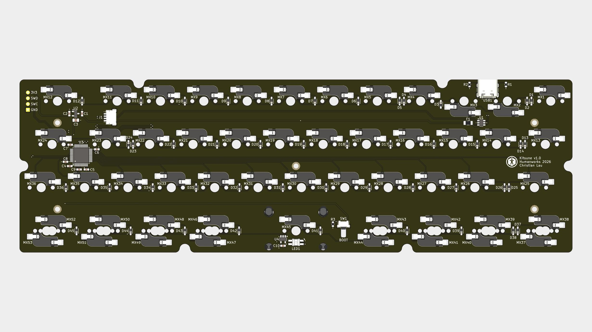
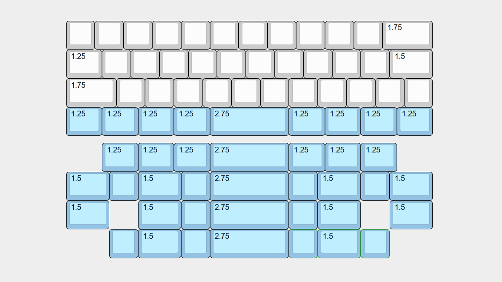

# CLKB (Compact Layer Keyboard)

A keyboard system for typing with your thoughts.

> [!TIP]
> I intend to do an in-stock sale of the CLKB if there's enough demand. If you're interested, please join the **[Initial Interest Check](https://docs.google.com/forms/d/e/1FAIpQLScfUuUE9FMXJtd4Nlhdzi1KQsgv8SQF635Pv1UQFJ2GWwssOQ/viewform?usp=dialog)** and **[Discord Server](https://discord.gg/7n4hk5pMTZ)**
>
> It'll be cheaper than sourcing one yourself and a direct way to support me!

___

## Introduction

The CLKB is a keyboard system that uses Layers to make what is thought, what is typed.

With regular typing, keys can be mistyped, out of reach, or even need finding. But with Layers, the moment you think they are there, they will be there. The keys are brought right to your fingertips, ready to be typed!

The CLKB packs this (and more!) into a simple layout you already know how to use. It's carefully designed to feel as similar as possible to regular keyboards.

___

## Concept

Even with Layers, every key is still where you expect them. They are positioned similarly to regular keyboards.

All commonly used keys (including `'"`) are physically available, while the rest are on virtual Layers. Hold the dedicated thumb keys to activate the Layers when you need to type them.

___

## Features

Full features on the [CLKB Wiki](https://github.com/christianlauex/clkb-keyboard/wiki)

<!-- ### Ultra Compact Size -->

    

        <h3>Ultra Compact Size</h3>
    

    

        
    

    

        The 40% layout fits right into your hands.
          
        Take the CLKB anywhere and use it anytime to type anything.
    

<!-- ### Hotswap Mechanical Switches-->

    

        <h3>Hotswap Mechanical Switches</h3>
    

    

        
    

    

        Hotswap mechanical switches give every keystroke a smooth and tactile feedback.
          
        Swap in your favorites to make typing feel perfect to you.
    

<!-- ### VIA/ VIA Webapp Remapping -->

    

        <h3>QMK VIA/ VIAL Firmware</h3>
    

    

        
    

    

        Fully customisable QMK firmware compatible with VIA or VIAL. Create custom keymaps and macros right from your web browser.
          
        Think WASD should be the Arrow keys? Make it so yourself.
    

<!-- ### Media and Mouse Control -->

    

        <h3>Media and Mouse Control</h3>
    

    

        
    

    

        Move the mouse, reduce screen brightness or pause a song right from the keybaord using the dedicated mouse and media keys.
          
        Need to open a link? With hands still resting on the keyboard, the mouse keys can move the cursor over and click it.
    

<!-- ### LED Status Indicator-->

    

        <h3> LED Status Indicator</h3>
    

    

        
    

    

        A minimalist SK6812 LED indicator to display statuses.
          
        Static white when CapsLock is toggled. Blink azure or pink when switching OS modes.
    

<!-- ### Universal Standard PCB -->

    

        <h3>Universal Standard PCB</h3>
    

    

        
    

    

        The Kitsune PCB is the universal platform of the CLKB.
          
        Designed with standardised dimensions, mounting points and more for future development and compatibility.
    

<!-- ### Open Source Files -->

    

        <h3>Open Source Files</h3>
    

    

        
    

    

        Fully-featured and documented for anyone to build their own CLKB.
          
        Just purchase a complete PCB and you can 3D print the rest of the parts yourself!
    

___

## Gallery

Full gallery on the [CLKB Wiki](https://github.com/christianlauex/clkb-keyboard/wiki)

### Default Layout

  

  

### Alternative Layout

___

## Details

Full details on the [CLKB Wiki](https://github.com/christianlauex/clkb-keyboard/wiki)

<!-- ### Overview -->

    

        <h3>Overview</h3>
    

    <table>
        <tbody>
            <tr>
                <td><b>Connection</b></td>
                <td>Wired USB</td>
            </tr>
            <tr>
                <td><b>PCB</b></td>
                <td>CLKB Kitsune PCB</td>
            </tr>
            <tr>
                <td><b>Switch Type</b></td>
                <td>Hotswap Normal Profile</td>
            </tr>
            <tr>
                <td><b>Case</b></td>
                <td>CLKB Standard Case</td>
            </tr>
            <tr>
                <td><b>Plate</b></td>
                <td>CLKB Standard Plate</td>
            </tr>
            <tr>
                <td><b>Mounting Style</b></td>
                <td>Plate Mount</td>
            </tr>
            <tr>
                <td><b>Firmware</b></td>
                <td>
                    <ol type="a">
                        <li>QMK VIA</li>
                        <li>QMK VIAL</li>
                    </ol>
                </td>
            </tr>
            <tr>
                <td><b>Remapping Software</b></td>
                <td>
                    <ol type="a">
                        <li>VIA</li>
                        <li>VIAL</li>
                    </ol>
                </td>
            </tr>
            <tr>
                <td>
                    <b>Dimensions 
                    (W * D * H) (mm)</b>
                </td>
                <td>
                    <ul>
                        <li>249.4 * 82.8 * 14.5 (Case)
                        <li>249.4 * 82.8 * 26.9
                    </ul>
                </td>
            </tr>
        </tbody>
    </table>

<!-- ### Keymap -->

    

        <h3>Keymap</h3>
    

    

        Default keymap
          
        
    

<!-- ### Layout -->

    

        <h3>Layout</h3>
    

    

        Default and alternative layouts
          
        
    

<!-- ### Dimensions -->

    

        <h3>Dimensions</h3>
    

    

        All measurements are in millimeters (mm)
          
        
    

___

## Documentation

Full documentation on the [CLKB Wiki](https://github.com/christianlauex/clkb-keyboard/wiki)

* ### [User Guide](https://github.com/christianlauex/clkb-keyboard/wiki/User-Guide)
    * How to use the CLKB Keyboard
* ### [Build Guide](https://github.com/christianlauex/clkb-keyboard/wiki/Build-Guide)
    * How to source and build the CLKB keyboard
* ### [Assembly Guide](https://github.com/christianlauex/clkb-keyboard/wiki/Assembly-Guide)
    * How to assemble the CLKB Keyboard
* ### [Design Guide](https://github.com/christianlauex/clkb-keyboard/wiki/Design-Guide)
    * How to design for and around the CLKB keyboard

___

## FAQ

<!-- ### Is it wireless? -->

    

        <h3>Is it wireless?</h3>
    

    

        No.
          
        As of now, the CLKB is a wired-only keyboard. This keeps it simple, robust and affordable.
          
        However, I am developing a wireless version and intend to release one in the future.
          
        New designs take valuable time, money, and effort. But I'll continue, because I believe in this project. If you do too, please consider <a href="#about">supporting me</a>. Every contribution, no matter how small, helps push this project forward!
    

<!-- ### Is it low-profile? -->

    

        <h3>Is it low-profile?</h3>
    

    

        No.
          
        As of now, the CLKB only supports normal profile switches.
          
        However, I am also developing a low-profile version and intend to release one in the future.
          
        New designs take valuable time, money, and effort. But I'll continue, because I believe in this project. If you do too, please consider <a href="#about">supporting me</a>. Every contribution, no matter how small, helps push this project forward!
    

<!-- ### Is it compatible with macOS? -->

    

        <h3>Is it compatible with macOS?</h3>
    

    

        Yes.
          
        The CLKB has a dedicated macOS mode for using native modifiers (option, command). Refer to the <a href="#details">keymap.</a>
    

<!-- ### Does it have per-key RGB/ backlight? -->

    

        <h3>Does it have (RGB) lighting?</h3>
    

    

        No.
          
        The CLKB is designed for touch-typing, where keys are found and typed using muscle-memory, not vision. When you no longer need vision to type, a lighting system becomes uneccessary.
          
        Furthermore, the CLKB is designed to be robust. I believe simpler designs are more robust designs. A lighting system adds a new unecessary point for failure in the future.
    

___

## About

The CLKB is an open-source project developed with genuine care and passion to make typing easier, or just a little more fun, [for myself](https://github.com/christianlauex/clkb-keyboard/wiki/Design-Story) and now anyone. This will not change.

But as a 19-year-old graduating student, it has been my dream to earn a simple living by designing works for and with people. I do hope that the CLKB can be a step closer to achieving my dream!

If you're interested in, or inspired by the CLKB, please consider supporting me!

> [!TIP]
> * ### [Join the Initial Interest Check](https://docs.google.com/forms/d/e/1FAIpQLScfUuUE9FMXJtd4Nlhdzi1KQsgv8SQF635Pv1UQFJ2GWwssOQ/viewform?usp=dialog)
>   * I intend to do an in-stock sale of the CLKB if there's enough demand. If you're interested, please let me know!
>
>       It'll be cheaper than sourcing one yourself and a direct way to support me!

* ### [Join the Discord Server](https://discord.gg/7n4hk5pMTZ)
    * Join the community to stay updated, share ideas or ask questions! Knowing people interested in this project is a huge encouragement to me.

* ### [Buy me a coffee](https://buymeacoffee.com/christianlauex)
    * If you're feeling particularly generous, you may also choose to make a donation. Every dollar will help me afford better tools and materials to release new designs!

___

## Acknowledgement

* **[Jack Humbert](https://github.com/jackhumbert) & The QMK Contributors**
    * For creating and keeping [QMK firmware](https://github.com/qmk/qmk_firmware) open-source, fully-featured, and documented, which powers the CLKB.
* **[The KiCad Team](https://www.kicad.org)**
    * For creating and keeping [KiCAD](https://www.kicad.org) free and open-source, which was used to design my PCBs.
* **[Ian Prest](https://github.com/ijprest)**
    * For creating [keyboard-layout-editor.com](https://github.com/ijprest/keyboard-layout-editor), which was the playground for my very first ideas.
* **[Un Kyu Lee](https://github.com/unkyulee)**
    * For his writings in the [Micro Journal project](https://github.com/unkyulee/micro-journal), which inspired me to improve my documentation.

___

## License

This work is licensed under
[CC BY-NC-SA 4.0](https://creativecommons.org/licenses/by-nc-sa/4.0/deed.en).

For commercial enquiries, please contact christianlauex@gmail.com.