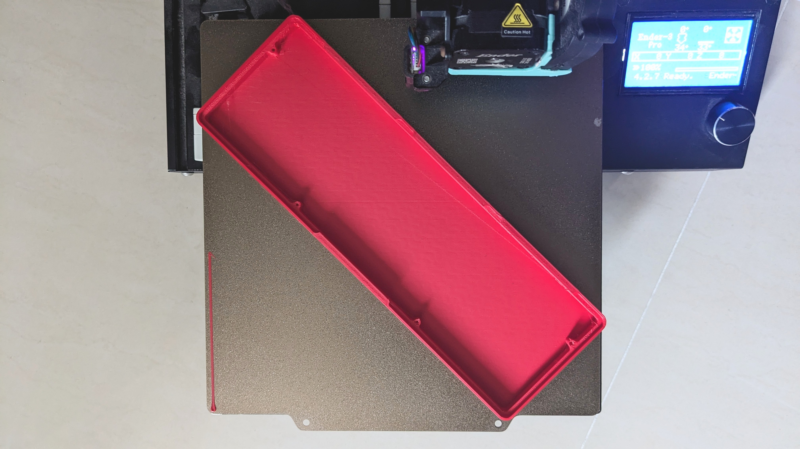

# CLS (Compact Layer System) Keyboard

### A keyboard system for typing with your thoughts.

## Introduction

The CLS is a keyboard system that uses Layers to make what is thought what is typed.

With regular typing, keys can be mistyped, out of reach, or even need finding. But with Layers, the moment you think they are there, they will be there. The keys are brought right to your fingertips, ready to be typed.

The CLS packs this into a compact layout you already know how to use!

> [!IMPORTANT]
> The CLS is an open-source project, all files will be released after launch. But if you're interested to purchase one now, join the **[Initial Interest Check](#support)**!

## Concept

Even with Layers, every key is still where you expect them, positioned similarly to regular keyboards.

All commonly used keys (including `'"`) are physically available, while the rest are on virtual Layers. Hold the dedicated thumb keys to activate the Layers when you need to type them.

## Features

<!-- ### Ultra Compact Size -->

    

        <h3>Ultra Compact Size</h3>
    

    

        
    

    

        The 40% layout fits right into your hands.
          
        Take the CLS anywhere and use it anytime to type anything.
    

<!-- ### Hotswap Mechanical Switches-->

    

        <h3>Hotswap Mechanical Switches</h3>
    

    

        
    

    

        Hotswap mechanical switches give every keystroke a smooth and tactile feedback.
          
        Swap in your favorites to make typing feel perfect to you.
    

<!-- ### VIA/ VIA Webapp Remapping -->

    

        <h3>QMK VIA/ VIAL Firmware</h3>
    

    

        
    

    

        Fully customisable QMK firmware compatible with VIA or VIAL. Create custom keymaps and macros right from your web browser.
          
        Think WASD should be the Arrow keys? Make it so yourself.
    

<!-- ### Media and Mouse Control -->

    

        <h3>Media and Mouse Control</h3>
    

    

        
    

    

        Move the mouse, reduce screen brightness or pause a song right from the keybaord using the dedicated mouse and media keys.
          
        Need to open a link? With hands still resting on the keyboard, the mouse keys can move the cursor over and click it.
    

<!-- ### LED Status Indicator-->

    

        <h3> LED Status Indicator</h3>
    

    

        
    

    

        A minimalist SK6812 LED indicator to display statuses.
          
        Static white when CapsLock is toggled. Blink azure or pink when switching OS modes.
    

<!-- ### Universal Standard PCB -->

    

        <h3>Universal Standard PCB</h3>
    

    

        
    

    

        The Kitsune PCB is the universal platform of the CLS.
          
        Designed with standardised dimensions, mounting points and more for future development and compatibility.
    

<!-- ### Open Source Files -->

    

        <h3>Open Source Files</h3>
    

    

        
    

    

        Fully-featured and documented for anyone to build their own CLS.
          
        Just purchase a complete PCB and you can 3D print the rest of the parts yourself!
    

## Details

<!-- ### Overview -->

    

        <h3>Overview</h3>
    

    <table>
        <tbody>
            <tr>
                <td><b>Connection</b></td>
                <td>Wired USB</td>
            </tr>
            <tr>
                <td><b>PCB</b></td>
                <td>CLS Kitsune PCB</td>
            </tr>
            <tr>
                <td><b>Switch Type</b></td>
                <td>Hotswap Normal Profile</td>
            </tr>
            <tr>
                <td><b>Case</b></td>
                <td>CLS Standard Case</td>
            </tr>
            <tr>
                <td><b>Plate</b></td>
                <td>CLS Standard Plate</td>
            </tr>
            <tr>
                <td><b>Mounting Style</b></td>
                <td>Plate Mount</td>
            </tr>
            <tr>
                <td><b>Firmware</b></td>
                <td>
                    <ol type="a">
                        <li>QMK VIA</li>
                        <li>QMK VIAL</li>
                    </ol>
                </td>
            </tr>
            <tr>
                <td><b>Remapping Software</b></td>
                <td>
                    <ol type="a">
                        <li>VIA</li>
                        <li>VIAL</li>
                    </ol>
                </td>
            </tr>
            <tr>
                <td>
                    <b>Dimensions 
                    (W * D * H) (mm)</b>
                </td>
                <td>
                    <ul>
                        <li>249.4 * 82.8 * 14.5 (Case)
                        <li>249.4 * 82.8 * 26.9
                    </ul>
                </td>
            </tr>
        </tbody>
    </table>

<!-- ### Keymap -->

    

        <h3>Keymap</h3>
    

    

        Default keymap
          
        
    

<!-- ### Layout -->

    

        <h3>Layout</h3>
    

    

        Default and alternative layouts
          
        
    

<!-- ### Dimensions -->

    

        <h3>Dimensions</h3>
    

    

        All measurements are in millimeters (mm)
          
        
        
    

<!-- ### User Manual -->

    

        <h3>User Guide</h3>
    

    

        TBD
    

<!-- ### Build Guide -->

    

        <h3>Build Guide</h3>
    

    

        TBD
    

<!-- ### Design Guide -->

    

        <h3>Design Guide</h3>
    

    

        TBD
    

## Gallery

<!-- ### CNC Machined -->

    

        <h3>CNC Machined</h3>
    

    

        TBD
    

<!-- ### 3D Printed -->

    

        <h3>3D Printed</h3>
    

    

        
        
        
        
        
        
          
        Alternative Layouts
          
        
        
    

## FAQ

<!-- ### Is it wireless? -->

    

        <h3>Is it wireless?</h3>
    

    

        No.
          
        As of now, the CLS is a wired-only keyboard. This keeps it simple, robust and affordable.
          
        However, I am developing a wireless version and intend to release one in the future.
          
        New designs take valuable time, money, and effort. But I'll continue, because I believe in this project.
          
        If you do too, please consider <a href="#support">supporting me</a>. Every contribution, no matter how small, helps push this project forward!
    

<!-- ### Is it compatible with macOS? -->

    

        <h3>Is it compatible with macOS?</h3>
    

    

        Yes.
          
        The CLS has a dedicated macOS mode for using native modifiers (option, command). Refer to the <a href="#details">keymap.</a>
    

<!-- ### Does it have per-key RGB/ backlight? -->

    

        <h3>Does it have per-key RGB/ backlight?</h3>
    

    

        No.
          
        The CLS is designed for touch-typing, where keys are found and typed using muscle-memory, not vision. When you no longer need vision to type, a lighting system becomes uneccessary.
          
        Furthermore, the CLS is designed to be robust. I believe simpler designs are more robust designs. A lighting system adds a new unecessary point for failure in the future.
    

## About

When I learnt to [touch-type](https://www.uow.edu.au/student/support-services/academic-skills/online-resources/technology-and-software/typing/), typing became a seamless act of turning what I thought into what I typed.

But it wasn't.

Touch-typing made typing *Letters* seamless. But for typing Numbers and Symbols, or navigating with Arrows, it fell apart. This was because the regular keyboard pulled those keys away from my fingers. It forced my mind to stop, my eyes to search, and my hands to reach.

So I set out to find a solution. The HHKB and JD40 keyboards caught my eye. I was drawn to their efficiency, but ultimately turned off by their complexity. Realising that this gap existed, I took it upon myself to develop my own. A keyboard to:

1. **Type Perfectly**

    Type all keys using simple touch-typing muscle-memory, so I'd never need to search again.

2. **Type Instantly**

    Type any key right from my fingertips, so I'd never need to reach again.

3. **Type Familiarly**

    Still feel familiar to type on, so I'd be able to use regular keyboards without much change.

Over the past year, I've quietly worked on this personal project. After carefully designing, sourcing and assembling various prototypes, I am proud to say that the CLS is my solution, and more! And now I hope to share it with you!

<table>
    <thead>
        <tr>
            <th>Date</th>
            <th>Name</th>
            <th width=200>Preview</th>
        </tr>
    </thead>
    <tbody>
        <tr>
            <td>03 Feb 2025</td>
            <td>CLS Layout</td>
            <td>
                
            </td>
        </tr>
        <tr>
            <td>05 Mar 2025</td>
            <td>Testpad</td>
            <td>
                
            </td>
        </tr>
        <tr>
            <td>18 Mar 2025</td>
            <td>Kitsune PCB v0.1</td>
            <td>
                
            </td>
        </tr>
        <tr>
            <td>18 Mar 2025</td>
            <td>QMK VIA Firmware </td>
            <td>
                
            </td>
        </tr>
        <tr>
            <td>13 Apr 2025</td>
            <td>Memento Case</td>
            <td>
                <!--  -->
            </td>
        </tr>
        <tr>
            <td>13 Apr 2025</td>
            <td>CLS Prototype 1</td>
            <td>
                
            </td>
        </tr>
        <tr>
            <td>15 Jun 2025</td>
            <td>CLS Multi-layout</td>
            <td>
                
            </td>
        </tr>
        <tr>
            <td>22 Aug 2025</td>
            <td>Kitsune PCB v0.2</td>
            <td>
                
            </td>
        </tr>
        <tr>
            <td>22 Aug 2025</td>
            <td>Standard Case</td>
            <td>
                <!--  -->
            </td>
        </tr>
        <tr>
            <td>22 Aug 2025</td>
            <td>CLS Prototype 2</td>
            <td>
                
            </td>
        </tr>
        <tr>
            <td>11 Sep 2025</td>
            <td>QMK VIAL Firmware </td>
            <td>
                
            </td>
        </tr>
        <tr>
            <td>14 Mar 2026</td>
            <td>Slate Case</td>
            <td>
                
            </td>
        </tr>
        <tr>
            <td>14 Mar 2026</td>
            <td>CLS Prototype 3</td>
            <td>
                <!--  -->
            </td>
        </tr>
        <tr>
            <td>01 Apr 2026</td>
            <td>Kitsune PCB v1.0</td>
            <td>
                
            </td>
        </tr>
        <tr>
            <td>TBD</td>
            <td>CLS v1.0</td>
            <td>
                <!--  -->
            </td>
        </tr>
    </tbody>
</table>

## Support

The CLS is an open-source project developed with genuine care and passion to make typing easier, or just a little more fun, for myself and now anyone. This will not change.

But as a 19-year-old graduating student, it has been my dream to earn a simple living by designing works for and with people. I do hope that the CLS can be a step closer to achieving my dream!

If you're interested, or inspired by the CLS, please consider supporting me!

> [!IMPORTANT]
> * **[Fill out the Initial Interest Check](https://docs.google.com/forms/d/e/1FAIpQLScfUuUE9FMXJtd4Nlhdzi1KQsgv8SQF635Pv1UQFJ2GWwssOQ/viewform?usp=dialog)**
>
>   Let me know if you're interested to purchase a CLS! I hope to work with you and the community to make it possible.

* **[Join the Discord Server](https://discord.gg/7n4hk5pMTZ)**

    Join the community to stay updated, share ideas or ask questions! Knowing people interested in this project is a huge encouragement to me.

* **[Buy me a coffee](https://buymeacoffee.com/christianlauex)**

    If you're feeling particularly generous, you may also choose to make a donation. Every dollar will help me afford better tools and materials to release new designs!

## Acknowledgements

* **[Jack Humbert](https://github.com/jackhumbert) & The QMK Contributors**
    * For creating and keeping [QMK firmware](https://github.com/qmk/qmk_firmware) open-source, fully-featured, and documented, which powers the CLS.
* **[The KiCad Team](https://www.kicad.org)**
    * For creating and keeping [KiCAD](https://www.kicad.org) free and open-source, which was used to design my PCBs.
* **[Ian Prest](https://github.com/ijprest)**
    * For creating [keyboard-layout-editor.com](https://github.com/ijprest/keyboard-layout-editor), which was the playground for my very first ideas.
* **[Un Kyu Lee](https://github.com/unkyulee)**
    * For his writings in the [Micro Journal project](https://github.com/unkyulee/micro-journal), which inspired me to improve my documentation.

## License

This work is licensed under
[CC BY-NC-SA 4.0](https://creativecommons.org/licenses/by-nc-sa/4.0/deed.en).

For commercial enquiries, please contact christianlauex@gmail.com.

